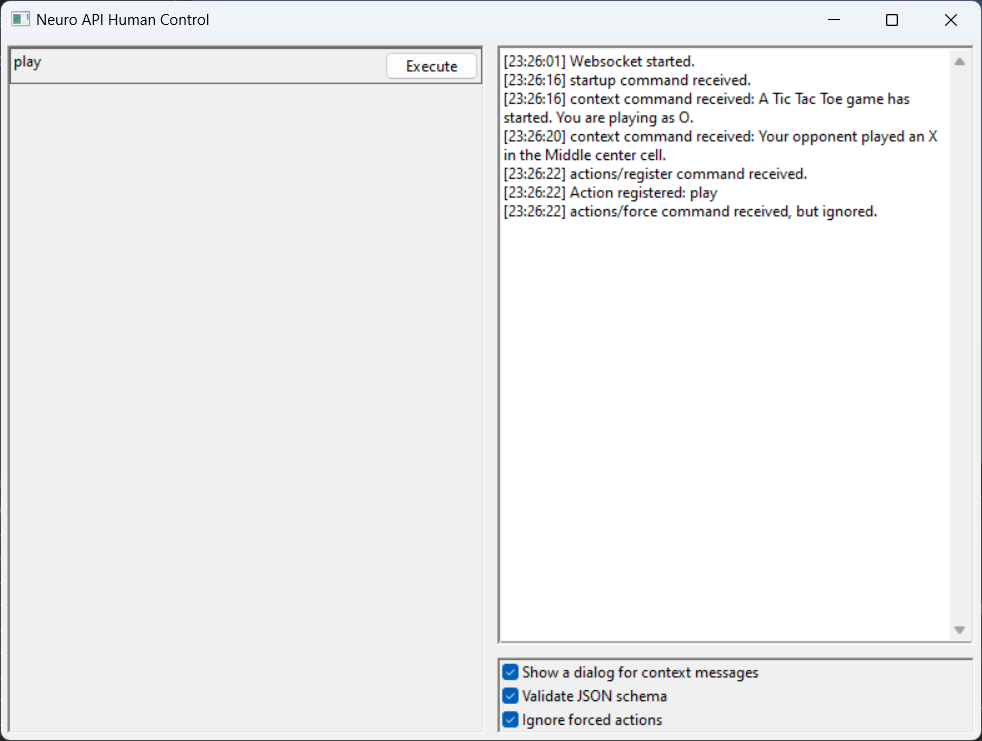
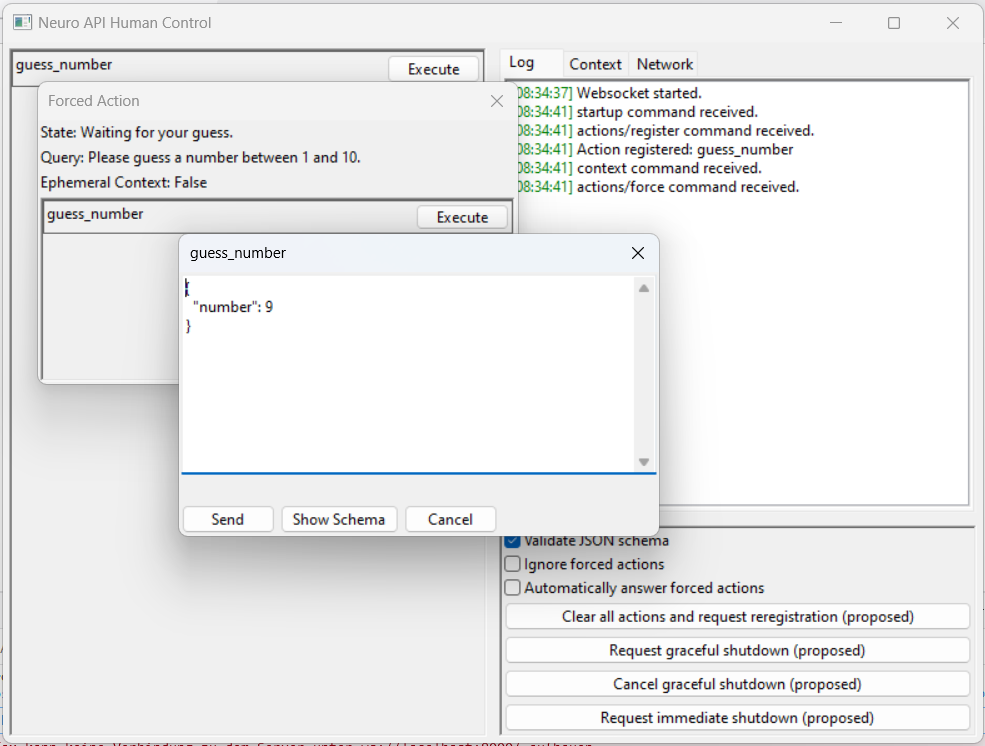

# Neuro API Human Control

Graphical implementation of the Neuro API in python.
Like [Randy](https://github.com/VedalAI/neuro-game-sdk/blob/main/Randy), it can answer `actions/force` commands automatically, but also allows the user to formulate the response Neuro would send themselves, as well as send non-forced actions whenever.

> [!Note]
> I cannot guarantee that this implementation perfectly emulates what Neuro could/would do, or that it is error-free.
> There might be some things that I have overlooked.

## Installation

This will install the package in a virtual environment to not conflict with any global packages.
Skip steps 2 and 3 if you don't want a virtual environment.

1. Clone the repository with `git clone https://github.com/Pasu4/neuro-api-human-control.git` or download it from GitHub
2. Run `python -m venv .venv` (in the downloaded folder)
3. Run `.\.venv\Scripts\activate` (Windows)
    - `source ./.venv/bin/activate` on Linux / Mac (?)
4. Run `pip install -r requirements.txt`

## Usage

This assumes you have set up a virtual environment during installation.
Skip step 1 if you haven't, or if your virtual environment is already activated.

1. Run `.\.venv\Scripts\activate` (Windows)
    - `source ./.venv/bin/activate` on Linux / Mac (?)
2. Run `python -m src`

The application window should now open.
The left panel will display the actions once they have been registered.
They can be executed by clicking the "execute" button next to the action's name.
The right panel shows an event log, below that is a smaller panel with some controls.
After sending an `action` command to the game, the next action can only be sent after the `action/result` command has been received.
When the game sends an `actions/force` command, a window will open that only shows the applicable actions, and will only close once the `action/result` command indicates success.

Like Randy, this application opens a websocket server on port `8000` (websocket URL `ws://localhost:8000`).

## Screenshots

